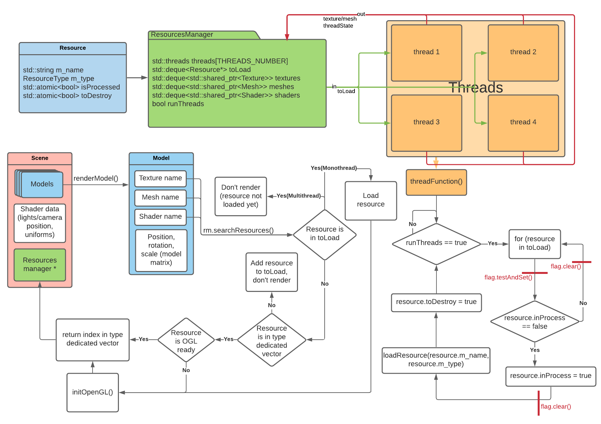

# ResourcesManager

## <h2 id="top">Summary</h2>
---
-[Currently implemented](#implemented)   
-[Controls](#ctrl)  
-[Screenshots](#screenshots)  
-[Additionnal notes](#notes)  
-[External libraries](#libs)  

## <h2 id="implemented"> Implemented </h2>
---
- Threadpool for texture/mesh loading
- Scene reloading (F5)
- Functional timer for monothreaded loading  
- Functional timer for multithreaded loading
- Task queue emptying itself when needed  

## <h2 id="WIP"> En cours </h2>
---
- Fix random framerate drop on first scene loading (multithreaded)  
- Benchmark mode  
- Runtime swap between mono/multithread  
- Use a default texture when the texture isn't loaded yet

## <h2 id="ctrl">Controls</h2>
---
- Use WASD (Qwerty) or ZQSD (Azerty) to move the camera around the scene  
- Press space to go up, and left shift to go down
- Pres F5 to reload the current scene  

## <h2 id="screenshots"> Screenshots </h2>
---

  
Loading with multithread  

Diagram of the threading process  

## <h2 id="notes"> Additional notes </h2>
---
**Launch**  
To start the program, open `Engine.exe` (sirius) or `Engine.sln` (git). When using the git version, if the project doesn't work, check that you are using Visual Studio 2019 and that you are in x64. If the app still doesn't work, a .exe should be present in the folder `.\Engine\x64\Debug\`. The graphic resources used by the app are only on sirius.  

**Durations recorded**  
In monothread, the main scene takes approximately 9.9 seconds to load. In multithread, this time fluctuates between 7.7s and 8.1s.  

**Known issues**  
Sometimes, loading the main scene in multithread leads to a low and unstable framerate. Reloading the scene once usually fixes the issue.  
Launching the app with `THREADS_NUMBER` under 4 might crash on certain devices.  
Lauching from outside of Visual Studio breaks the colors in the console and print characters such as `←[96m`.  
Using left click while still loading the scene in multithread rarely causes a crash.  

## <h2 id="libs">External libraries</h2>
---
**This project uses:**  
-GLFW   
-stbimage  

[Top of the page](#top)